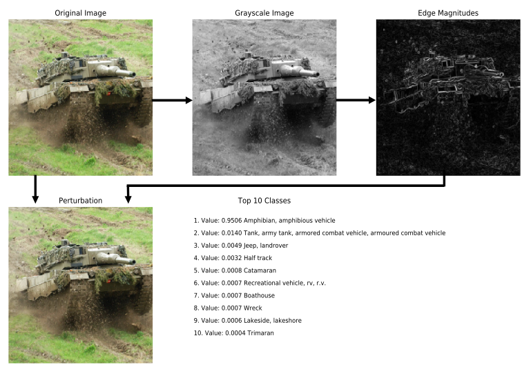
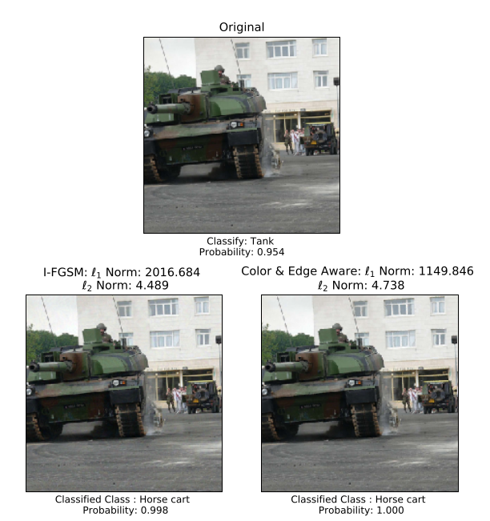

## Color and Edge-Aware Adversarial Perturbations.

This is a repository containing examples and source code for constructing adversarial image perturbations which accurately model human perception of color and texture. 

The image below compares our method to a multiple iteration version of the Fast Gradient Sign Method (Goodfellow et al., 2014), where our Color-and-Edge-Aware perturbation preserves the smooth texture of the sky while still disrupting the performance of the classifier.

If you find our work useful, please cite the following paper, where you can also find more information on the methods we developed.

Further background information on the topic of adversarial perturbations can be found in the following MS thesis.

Graves, Mitchell. [*Image Perturbation Generation: Exploring New Ways for Adversaries to Interrupt Neural Network Image Classifiers*](https://calhoun.nps.edu/handle/10945/65532). NAVAL POSTGRADUATE SCHOOL MONTEREY CA, 2020. 
